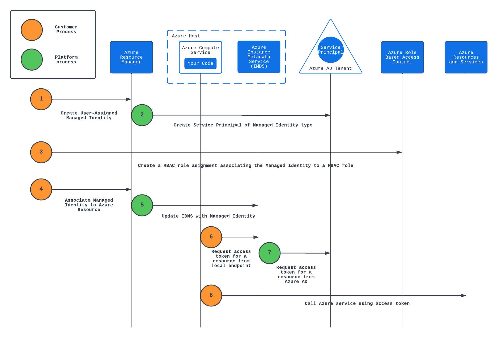
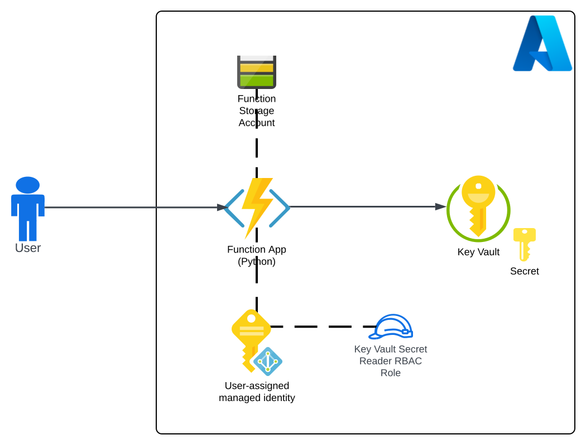

# Managed Identity Demo

## Overview
[Managed Identities](https://docs.microsoft.com/en-us/azure/active-directory/managed-identities-azure-resources/overview) ease the burden of managing the credentials for the identities used by application components to authenticate Azure services and each other. These applications can be running in Azure or running in [on-premises or another cloud](https://docs.microsoft.com/en-us/azure/azure-arc/servers/managed-identity-authentication). Managed Identities come in two forms, [system-assigned and user-assigned](https://docs.microsoft.com/en-us/azure/azure-arc/servers/managed-identity-authentication). This demonstration focuses on user-assigned managed identities because this type of managed identity betters aligns with the way organizations handle their identity and access management processes.

The image below illustrates how a user-assigned managed identity is created and used.

This repository includes a code in the form of ARM templates and Azure CLI commands to walk you through how to create and use a managed identity. This demo takes the "learn by doing" approach where a concept will be explained and then you will exercise on the concept.

The end state architecture of this demo is pictured below.

## Prerequisites

1. This demo will require you have sufficient permissions on the subscription to deploy resource groups, resources, and create RBAC Roles and RBAC assignments. It is recommended you do this on a non-production subscription where you hold the Owner role at the subscription level.

2. You must have the az CLI commands installed and configured.

## Lab Setup

Before you begin the exercises, the lab environment must be deployed. The ARM templates within this repository will deploy an Azure Function, Azure Storage Account for the Function, an Azure Key Vault, and a secret within the Azure Key Vault.

Deploy the lab environment by using the Deploy to Azure button below. Note that you must first create the resource group.

## Excercises

### Excercise 1

In the first exercise you will create a user-assigned management identity (UMI). You will view the properties of the UMI and find its service principal in Azure Active Directory.

1. Login to the the az CLI.

    **az login**

2. Set az CLI to use the appropriate subscription.Substitute the name of your subscription into the MY_SUBSCRIPTION_NAME placeholder.

    **az account set --subscription=MY_SUBSCRIPTION_NAME**

3. Create the user-assigned managed identity. Subs
In the Shared Services Virtual Network an Ubuntu (virtual machine) is deployed and is pre-loaded with Azure CLI, kubectl, and Docker. 

The Workload Virtual Network is deployed with an app, data, and supported services (PaaS services behind Private Endpoints). The workload resource group also contains a user-assigned managed identity which has been given permissions to get and list secrets in a Key Vault instance.

Additional features included:

* Azure Bastion provisioned in the hub to provide SSH and RDP (Remote Desktop Protocol) to deployed virtual machines
* Azure Firewall configured to send diagnostic logs to an instance of Log Analytics Workspace to allow for review of the traffic flowing to and from the Azure Function
* An Azure Key Vault instance which stores the user configured VM administrator username and password
* An Azure Key Vault instance for workloads deployed into the workload resource group
* All instances of Azure Key Vault are deployed with a Private Endpoint
* All subnets that support Network Security Groups are configured with them
* Network Security Groups are configured with NSG Flow Logs which are set to an Azure Storage Account and Traffic Analytics

## Prerequisites
1. You must hold at least the Contributor role within each Azure subscription you configure the template to deploy resources to.

2. Get the object id of the security principal (user, managed identity, service principal) that will have access to the Azure Key Vault instance. This will be used for the keyVaultAdmin parameter of the template.

**az ad user show --id someuser@sometenant.com --query objectId --output tsv**

3. Enable Network Watcher in the region you plan to deploy the resources using the Azure Portal method described in this link. Do not use the CLI option because the templates expect the Network Watcher resource to be named NetworkWatcher_REGION, such as NetworkWatcher_eastus2. The CLI names the resource watcher_REGION such as watcher_eastus2 which will cause the deployment of the environment to fail.

## Installation with Azure Portal

## Installation with Azure CLI
1. Set the following variables:
   * DEPLOYMENT_NAME - The name of the location
   * DEPLOYMENT_LOCATION - The location to create the deployment
   * LOCATION - The location to create the resources
   * ADMIN_USER_NAME - The name to set for the VM administrator username
   * ADMIN_OBJECT_ID - The object ID of the Azure AD User that will have full permissions on the Key Vault instances
   * SUBSCRIPTION - The name or id of the subscription you wish to deploy the resources to
   * ON_PREM_ADDRESS_SPACE - This is an optional parameter that represents on-premises address space

2. Set the CLI to the subscription you wish to deploy the resources to:

   * **az account set --subscription SUBSCRIPTION_ID**

4. Deploy the lab using the command (tags parameter is optional): 

   * **az deployment sub create --name $DEPLOYMENT_NAME --location $DEPLOYMENT_LOCATION --template-uri https://raw.githubusercontent.com/mattfeltonma/azure-labs/master/hub-and-spoke/azuredeploy.json --parameters location=$LOCATION vmAdminUsername=$ADMIN_USER_NAME keyVaultAdmin=$ADMIN_OBJECT_ID tags='{"mytag":"value"}'**

3.  You will be prompted to provide a password for the local administrator of the virtual machine. The username and password you set will be available to you as secrets in the "central" Key Vault provisioned as part of this lab.

## Post Installation
Once the lab is deployed, you can SSH into the Dev VM running in the hub using Azure Bastion.

